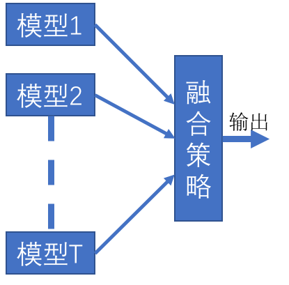

# 模型融合

所谓**模型融合**也叫**集成学习(Ensemble Learning)** 是通过构建多个机器学习的模型或学习器并按照一定的规则将这些模型与学习器结合起来完成整个学习任务。模型融合的可以用下图来表示：

## Content

- [Boosting](#Boosting)
- [Bagging](#Bagging)
- [Averaging](#Averaging)
- [Voting](#Voting)
- [Stacking](#Stacking)
- [Diversity](#Diversity)

## Boosting

